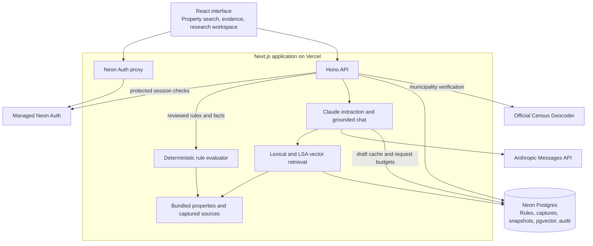
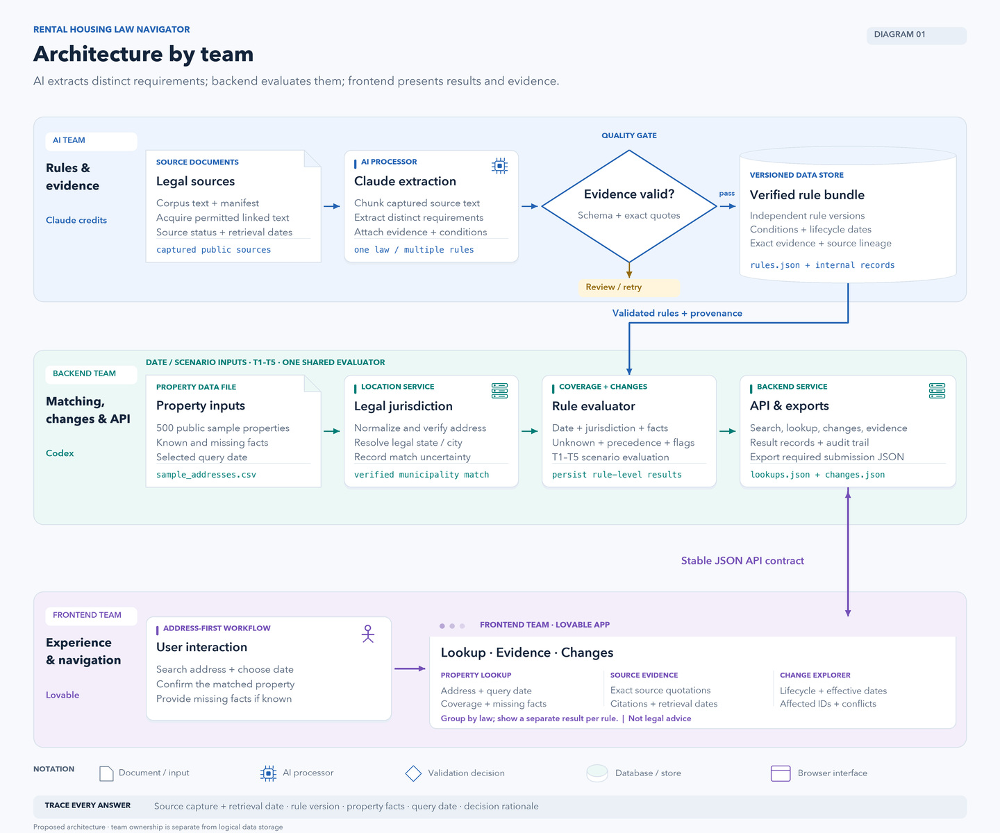
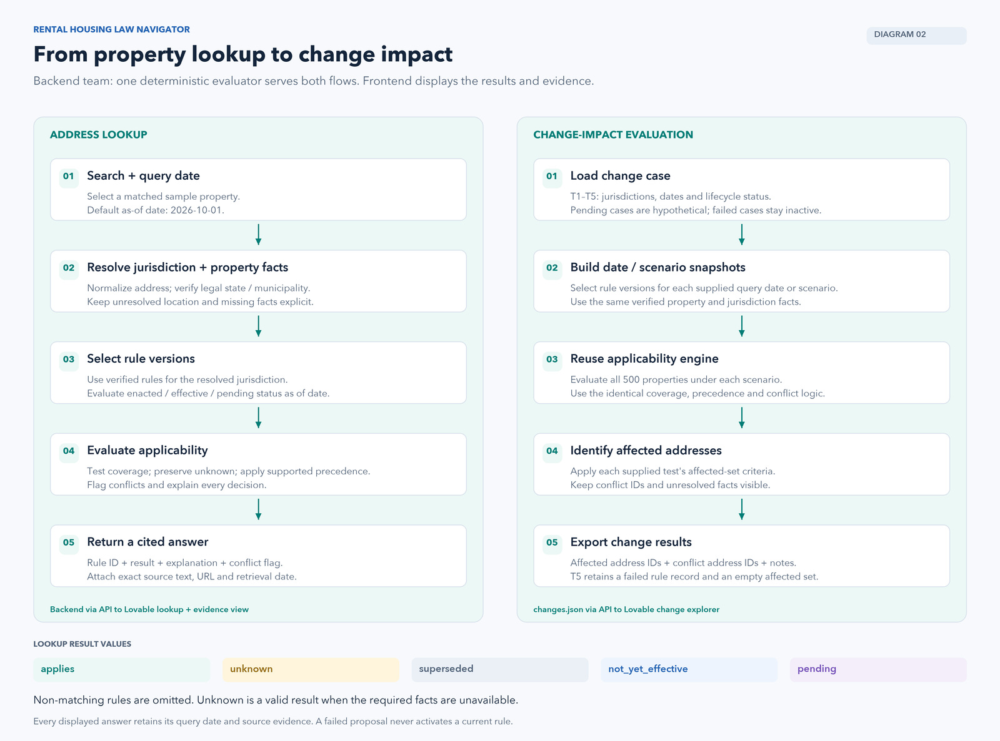
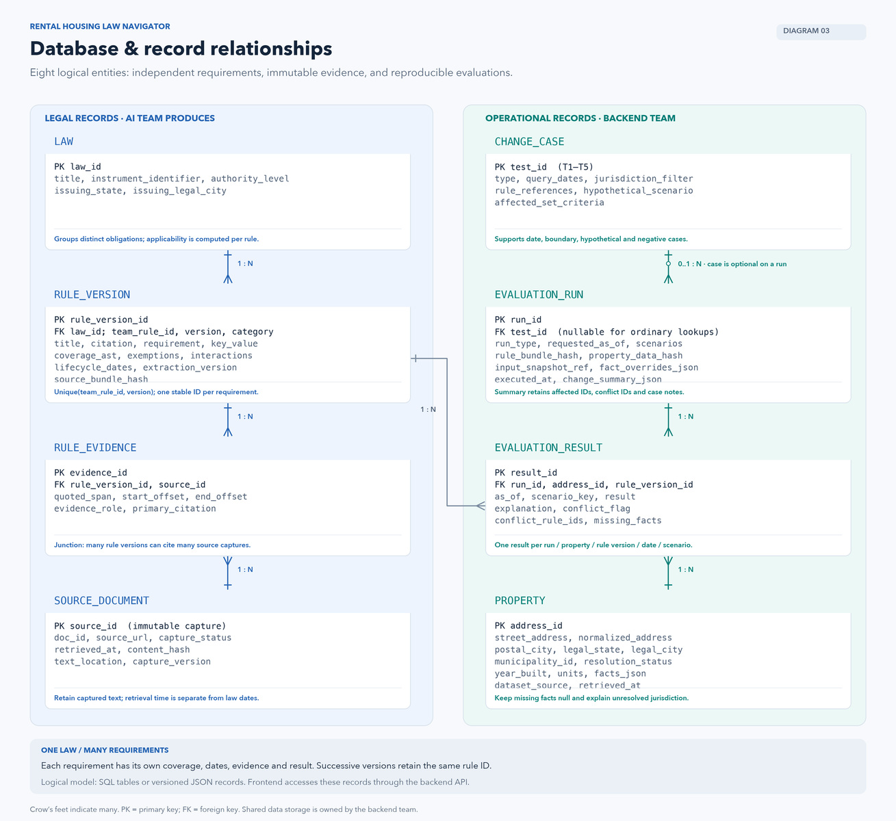
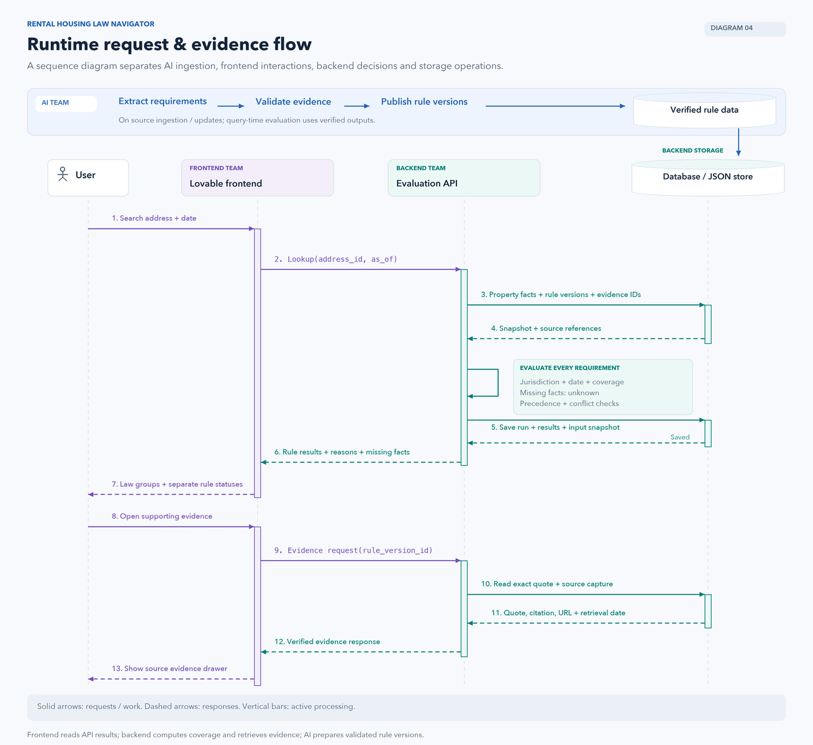
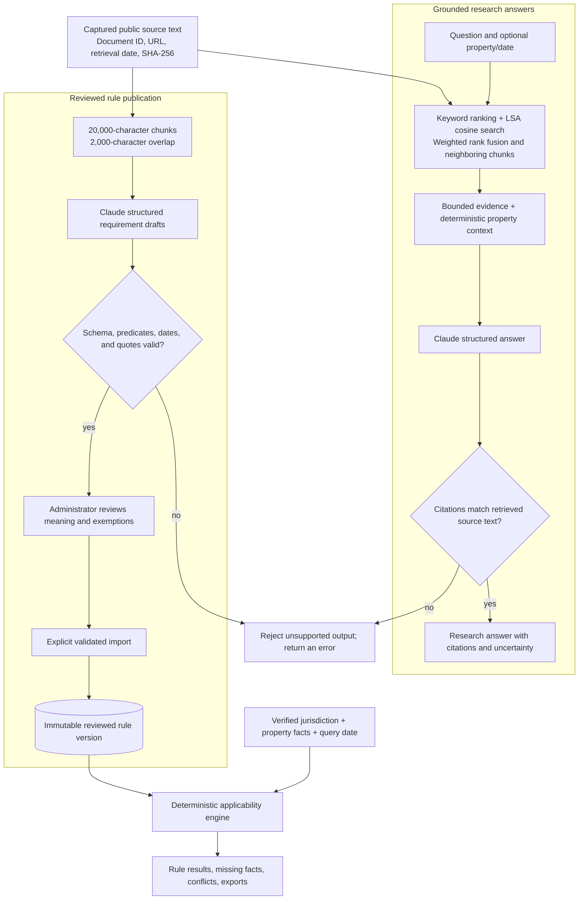

<div align="center">
  
  <h1>LEXRENT</h1>
  <p><strong>Rental housing law research, grounded in sources.</strong></p>
  <p>Find a property. Explore the evidence. Understand the requirements and the facts still missing.</p>
  <p>
    <a href="https://lexrent-zeta.vercel.app"><strong>Open the app</strong></a> ·
    <a href="#ai-implementation">AI implementation</a> ·
    <a href="#architecture-and-diagrams">Architecture</a> ·
    <a href="#getting-started">Get started</a>
  </p>
  <p>
    
    
    
    
    
  </p>
  <p>
    
    
    
    
    
  </p>
</div>

## About the project

LEXRENT is a research workspace built for the **Rental Housing Law Navigator challenge**. It connects rental properties in **California, New Jersey, and Massachusetts** to captured public source material, date-sensitive rule evaluation, and explanations of missing facts. Tenants, researchers, and reviewers can inspect the evidence behind a requirement and see where further review is needed.

The application combines a React interface, a Hono API, Claude assistance, a deterministic applicability engine, and Neon persistence in one Next.js deployment. Its six research categories cover rent increases, just-cause eviction, security deposits, application and screening fees, screening restrictions, and algorithmic rent setting.

The interface adapts the [original Lovable design](https://lovable.dev/projects/c3e1fb53-d8d2-42f7-a0ef-1775909ab00a): cream, royal blue, yellow, Lexend typography, rectangular controls, and an illustrated city skyline. The active app uses backend evaluations and captured evidence throughout the property workflow.

**Published starter corpus:** 500 properties · 87 source records · 54 captured documents · 33 link-only sources · 568 validated law-text chunks · 5 change cases.

The checked-in baseline seeds **zero reviewed legal rules**. Administrators extract, review, and import rule bundles before property-specific applicability can be established. A searchable corpus or an empty result does not establish complete legal coverage. The default research date is **October 1, 2026**; users can choose another query date.

> Not legal advice. Summaries are for research only; consult a qualified attorney or the relevant agency for your case.

## What you can do

| Capability | Experience |
| --- | --- |
| **Property research** | Search and browse the supplied 500-property sample; choose an address and date; inspect Overview, List, and Summary views. |
| **Evidence inspection** | Open source text, exact quotations, retrieval dates, and source links from the source library and evidence dialogs. |
| **Coverage evaluation** | Evaluate reviewed requirements against jurisdiction, dates, facts, exemptions, and explicit rule interactions; preserve `unknown` when information is missing. |
| **Grounded AI assistance** | Ask Claude questions with citations and optional property/date context in `/workspace`. |
| **Rule review** | Capture permitted source text, extract structured drafts, validate evidence, and import a reviewed version through administrator tools. |
| **Change analysis** | Run the five supplied T1–T5 cases and export `rules.json`, `lookups.json`, `changes.json`, and a separate readiness report. |
| **Saved research** | Sign in to save private properties and immutable evaluation snapshots with their rule-version references. |
| **Maps and imagery** | Explore Leaflet/OpenStreetMap previews, historical USDA/USGS aerial imagery, and nearby Street View links. |
| **Interface and sharing** | Use guided fact questions, English/Spanish information pages, printable summaries, and JSON snapshot downloads. |

Maps use Photon for visual address orientation. Exact property pins require a matching address; street and area views show their precision explicitly. **Legal municipality resolution uses the official Census geocoder separately.** Historical imagery and postal-city labels do not establish legal boundaries or current building facts.

## Technology stack

Versions below reflect the root [`package.json`](package.json) and committed [`package-lock.json`](package-lock.json). The root Next.js application is the deployed product; Python tools and the original TanStack Start export are retained as reference implementations.

| Layer | Technologies | Role |
| --- | --- | --- |
| Application | **Next.js 16.3.8**, **React / React DOM 19.3**, **TypeScript 5.9**, **Node.js 24+** | App Router pages, same-origin server routes, shared types, and server execution. |
| UI and styling | **Tailwind CSS 4.3**, Tailwind PostCSS, **Lexend 5.3**, **Lucide React 0.577** | Responsive interface, typography, and icons. |
| HTTP and validation | **Hono 4.13**, `@hono/vercel`, **Zod 4.6** | API routing, request validation, and structured data contracts. |
| AI | **Anthropic SDK 0.131.0**, **Claude Messages API** | Schema-constrained extraction drafts and grounded research answers. |
| Retrieval | **TF-IDF**, **truncated SVD / LSA**, **128-dimensional vectors**, **pgvector** | Local vector projection, exact cosine search, and weighted hybrid ranking. |
| Database and identity | **Neon Postgres**, **Neon serverless driver 1.2**, **Neon Auth 0.5.0-beta / Better Auth** | Versioned rules, source captures, vectors, sessions, private collections, and audit records. |
| Location | **Leaflet 1.9**, **OpenStreetMap**, **Photon**, **Census Geocoder** | Visual maps, address matching, and independently verified municipal boundaries. |
| Imagery | **USDA/USGS The National Map**, **Google Street View URLs** | Historical aerial previews and external panorama links without a map API key. |
| Build and tests | **npm**, **Webpack**, **tsx 4.23**, **csv-parse 7**, **Vitest 4.1** | Dependency management, builds, TypeScript utilities, CSV ingestion, and automated tests. |
| Hosting | **Vercel**, Node.js runtime, `iad1` region | One deployment for the frontend and API; additive, repeatable database migrations. |
| Reference tooling | **Python**, **NumPy**, **SciPy**, **scikit-learn**, **Pillow** | Original knowledge-base indexing/search, optional agent experiments, and architecture-image rendering. |

<p>
  
  
  
  
  
  
  
</p>

## Architecture and diagrams

### Deployed application

The browser, API, rule engine, and AI handlers share one deployment. Managed identity, persistent storage, and Claude are external services. Public source exploration is available without sign-in; paid AI and saved work require an account, and publication requires a verified administrator.



### Design and handoff gallery

These existing diagrams explain team responsibilities, lookup/change flow, the logical data model, and evidence handoffs. They are **concept diagrams**; the deployed application above and [`docs/architecture.md`](docs/architecture.md) describe the current services and physical storage. Expand a diagram to view it, or open its full-resolution JPG or editable SVG.

<details open>
<summary><strong>01 · System architecture and team responsibilities</strong></summary>



[Full-resolution JPG](architecture/01-system-architecture.jpg) · [Editable SVG](architecture/01-system-architecture.svg)

</details>

<details>
<summary><strong>02 · Property lookup and law-change evaluation</strong></summary>



[Full-resolution JPG](architecture/02-lookup-and-change-flow.jpg) · [Editable SVG](architecture/02-lookup-and-change-flow.svg)

</details>

<details>
<summary><strong>03 · Logical database relationships</strong></summary>



[Full-resolution JPG](architecture/03-database-relationships.jpg) · [Editable SVG](architecture/03-database-relationships.svg)

</details>

<details>
<summary><strong>04 · Request and evidence sequence</strong></summary>



[Full-resolution JPG](architecture/04-request-and-evidence-sequence.jpg) · [Editable SVG](architecture/04-request-and-evidence-sequence.svg)

</details>

See the [architecture notes and regeneration instructions](architecture/architecture-notes.md) for the diagram sources and renderer.

## AI implementation

The supplied materials in the main-folder `project description/` explain a Claude agent, a JSONL knowledge base, a vector index, a search tool, and challenge output contracts. Their executable counterparts are preserved in [`AI RAG/`](AI%20RAG/) and [`AI capabilities/`](AI%20capabilities/). The published web app implements the evidence-grounding approach in TypeScript inside its Next.js backend.

| Supplied material | Integration in LEXRENT |
| --- | --- |
| `build_agent_PY.txt` / [`build_agent.py`](AI%20RAG/build_agent.py) | Grounding, uncertainty, date, and citation instructions inform [`src/server/chat.ts`](src/server/chat.ts) and [`src/server/ai.ts`](src/server/ai.ts). The web app calls the Claude Messages API. |
| `rag_knowledge_base_JSONL.txt` / [`rag_knowledge_base.jsonl`](AI%20RAG/rag_knowledge_base.jsonl) | [`build-challenge-data.ts`](scripts/build-challenge-data.ts) validates the supplied chunks against captured documents and compiles the source/property inventory into `src/data/challenge.json`. |
| `kb_build_index_PY.txt` / [`kb_build_index.py`](AI%20RAG/kb_build_index.py) | The fitted TF-IDF/SVD model from `kb_index.npz` is exported by [`build-vector-model.ts`](scripts/build-vector-model.ts) for local TypeScript projection. |
| `kb_search_PY.txt` / [`kb_search.py`](AI%20RAG/kb_search.py) | Hybrid keyword/vector retrieval, scoped evidence selection, and neighboring passages support the web assistant. |
| `rag_vector_dataset_JSONL.txt` / [`rag_vector_dataset.jsonl`](AI%20RAG/rag_vector_dataset.jsonl) | The original vector dataset remains available for reference; runtime vectors are generated from the fixed model and current validated source chunks. |
| `task_reference_JSON.txt` / [`task_reference.json`](AI%20RAG/task_reference.json) | Rule categories, required JSON outputs, and T1–T5 fixtures inform the typed domain contracts, validator, evaluator, and exports. |

### Two evidence workflows



### 1. Knowledge preparation and hybrid retrieval

The build validates **568 supplied law chunks** against the captured source documents and restores original whitespace for evidence. Each chunk retains its document identity, URL, retrieval date, content hash, and source offsets. Link-only records remain visible acquisition gaps and cannot support citations.

The original Python tooling builds TF-IDF features and a truncated-SVD **128-dimensional LSA** projection. The app uses the exported, server-only [`vector-model.json`](src/data/vector-model.json) to project questions and current source chunks locally. These are statistical LSA vectors; no separate neural-embedding API or Python service is required for the web application.

Neon stores versioned corpora and vectors in `lexrent_vector_corpora` and `lexrent_vector_chunks`. A corpus fingerprint includes the fitted model and current chunk content/metadata. Indexing is atomic and idempotent, and current source hashes and URLs prevent changed captures from reusing stale evidence. Retrieval uses exact pgvector cosine search at this corpus size.

The web assistant combines **BM25-style lexical ranking** with vector matches using **weighted reciprocal rank fusion: lexical weight 2, vector weight 1**. It selects up to eight primary passages, adds adjacent chunks within a 32,000-character evidence budget, and includes relevant property/date context. Lexical fallback remains available when vector retrieval cannot contribute, with that mode exposed in the answer metadata. Topic aliases help some multilingual queries; the fitted model's ASCII tokenizer has limited multilingual coverage.

### 2. Grounded Claude answers

[`chat.ts`](src/server/chat.ts) sends retrieved evidence and, when selected, the deterministic property evaluation to Claude using a constrained JSON response schema. The server validates the response with Zod, requires supporting citations, checks each quotation against the retrieved intervals of the current source capture, and attaches the authoritative URL and retrieval timestamp itself. Invalid or unsupported citations reject the answer.

The prompt instructs Claude to preserve unknown facts, distinguish pending/failed/future-effective measures, and honor the query date. Captured text, questions, and conversation history are treated as untrusted input. The deployed assistant has no browsing or shell tools. It produces research summaries; it cannot import rules or change evaluator verdicts. Quote validation establishes provenance, while the accuracy of an interpretation still requires review.

### 3. Structured extraction and human review

[`ai.ts`](src/server/ai.ts) processes long captures in overlapping chunks and requests **one atomic requirement per draft**. Drafts include source evidence, lifecycle dates, exemptions, typed coverage predicates, and proposed rule interactions. One law can therefore yield multiple requirements with different coverage or operative dates.

The server assigns source identities, validates schema and quotations, rejects executable-code conditions, and returns `requires_review: true`. [`extraction-store.ts`](src/server/extraction-store.ts) caches drafts by source identity/content hash, model, prompt version, and chunk so work can resume without repeating accepted extraction. An administrator reviews all chunks, deduplicates obligations, and explicitly imports a validated bundle; extraction never publishes automatically.

The configured default in this repository is `claude-sonnet-5-5`. Set `CLAUDE_MODEL` to a model enabled for your Anthropic account. Provider calls use a 60-second timeout and one retry. Durable hourly limits are **20 chat attempts per account**, **60 extraction attempts per administrator**, and **200 AI attempts globally**; provider failures also consume an attempt. Valid cached extraction drafts avoid a new provider request.

The supplied Python managed-agent experiment remains optional reference tooling. Its cloud agent environment and unrestricted toolset are separate from the deployed web application. Credentials for the maintained [`build_agent_v1.py`](AI%20capabilities/build_agent_v1.py) come from `ANTHROPIC_API_KEY`.

## Applicability and review workflow

The typed evaluator applies reviewed rules to a property, legal jurisdiction, query date, and available facts. Predicates support `all`, `any`, `not`, and typed comparisons. Missing facts preserve uncertainty; scenario inputs are recorded as supplied facts, and cannot overwrite the property's state or verified legal city.

Lifecycle and reviewed interaction records distinguish active, future-effective, pending, failed, conflicting, and superseded requirements. `certificate_age_years` is recomputed from the certificate-of-occupancy date for each query; a construction year never substitutes for that date. The frontend displays the evaluator's results and explanations.

1. Sign in with a verified, allowlisted administrator account.
2. Inspect a captured source, or capture permitted text for an existing manifest source with its matching URL and retrieval timestamp.
3. Extract drafts across all chunks; review legal meaning, status, dates, exemptions, and interactions.
4. Validate and import the reviewed bundle. Imports merge by rule ID unless `mode: "replace"` is explicitly requested.
5. Resolve relevant municipal boundaries and supply known missing facts as labelled scenarios.
6. Run T1–T5, inspect unresolved items, and export the challenge artifacts.

`coverage_complete` remains `false`. Submission readiness checks that reviewed rules exist and all five cases are evaluated, and reports unresolved addresses separately; it does not certify complete sources, facts, or legal analysis. Retrieval presents selected passages, so an absent passage cannot prove that a full document lacks a provision. Source quotation checks use stored captures, whose completeness and authority require review.

## Getting started

### Explore the public sample

Use **Node.js 24 or newer** and npm. With `DATABASE_URL` unset, the application can serve the bundled properties and captured sources without external credentials.

```sh
git clone https://github.com/newpoluton-alt/LEXRENT.git
cd LEXRENT
npm ci
npm run dev
```

Open [localhost:3000](http://localhost:3000). Accounts, persistent saved work, rule imports, and paid AI require the services below. Development and production builds use the project's configured Webpack compiler.

### Enable accounts, persistence, and AI

```sh
cp .env.example .env
# Replace placeholders with your server configuration before continuing.
npm run db:migrate
# Optional: pre-index current evidence; indexing also runs lazily when needed.
npm run rag:index
npm run dev
```

| Variable | Purpose |
| --- | --- |
| `DATABASE_URL` | Neon Postgres runtime connection string; required for persisted rules, research, vectors, and AI budgets. |
| `NEON_AUTH_BASE_URL` | Managed Neon Auth branch endpoint. |
| `NEON_AUTH_COOKIE_SECRET` | Random secret of at least 32 characters for signed session cookies. |
| `LEXRENT_ADMIN_EMAILS` | Comma-separated administrator allowlist; access also requires a live session and verified email. |
| `ANTHROPIC_API_KEY` | Server-side Claude credential for extraction and answers. |
| `CLAUDE_MODEL` | Model override; repository default: `claude-sonnet-5-5`. |
| `APP_URL` | App origin; use `http://localhost:3000` locally. |
| `NEON_API_KEY` | Optional management credential; not a substitute for the runtime database connection. |

Keep credentials server-side. `.env`, auth artifacts, and `.vercel` are ignored; `.env.example` contains placeholders. An invalid configured database produces an explicit failure, rather than substituting an empty reviewed rule set.

Enable Google in Neon Auth if needed, and whitelist the production and localhost origins. Email/password administrators must verify their email. Authentication returns through `/auth/callback` and checks the live session before restoring the user's property or workspace context. Production app access is public; Vercel previews remain protected.

## Codebase guide

```text
app/                         Next.js pages, layouts, API routes, auth callback
src/components/lovable/      Active property UI, evidence, maps, imagery, account flow
src/components/research-workspace.tsx Research workspace and administrator tools
src/domain/                  Types, validation, rule engine, changes, exports, vectors
src/server/                  Hono API, auth, database, Claude, retrieval, Census resolver
src/data/                    Compiled challenge inventory and fitted vector model
migrations/                  Core persistence, AI draft storage, and pgvector SQL
scripts/                     Corpus build, vector export, migrations, vector indexing
tests/                       Domain, API, AI, auth, frontend, maps, and imagery checks
docs/architecture.md         Implemented architecture, storage, access, and contracts
architecture/                Concept diagrams, editable SVGs, JPGs, and renderer
AI RAG/                      Supplied JSONL knowledge, Python search/index, task reference
AI capabilities/             Earlier Claude agent experiment and reference knowledge
participant-final-no-hour16 3/ Original challenge sources, properties, schema, and fixtures
lexrent/                     Original Lovable/TanStack Start export retained for reference
```

The reference `lexrent/` app is excluded from active TypeScript compilation and deployment. Its static sample verdicts do not determine results in the active application. Python experiments and duplicate index datasets are also excluded from the web deployment; builds use the supplied knowledge JSONL and deploy the compiled corpus/model.

## Development and verification

| Command | Purpose |
| --- | --- |
| `npm run dev` | Start the development server. |
| `npm run data:build` | Rebuild and validate the bundled challenge data. |
| `npm run vector:model` | Export the fitted model after changing the supplied NPZ. |
| `npm run db:migrate` | Apply additive, repeatable database migrations. |
| `npm run rag:index` | Index the current source corpus in Neon pgvector. |
| `npm run typecheck` | Check TypeScript types. |
| `npm test` / `npm run test:watch` | Run Vitest once or in watch mode. |
| `npm run build` / `npm start` | Build the application and serve the production build. |

Run the standard checks before deployment:

```sh
npm run typecheck
npm test
npm run build
```

Tests cover deterministic evaluation, validation, citation grounding, extraction contracts, vector versioning, persistence limits, authorization, and frontend behavior. The live Neon integration check is opt-in and uses temporary test-owner records:

```sh
RUN_NEON_INTEGRATION=1 node --env-file=.env node_modules/vitest/vitest.mjs run tests/auth/neon-live.test.ts
```

The existing Vercel configuration deploys the frontend and API together on the Node.js runtime in `iad1`. Set server variables in the Vercel project environment settings, apply migrations, run the checks, and deploy with `vercel --prod`.

## Project origins

LEXRENT brings together the supplied challenge corpus and AI reference materials, the Lovable interface design, and the integrated backend implementation. [Architecture and team ownership](docs/architecture.md) document the handoffs: AI produces evidence-backed drafts, the backend validates and evaluates reviewed rules, and the frontend presents results and their uncertainty.
