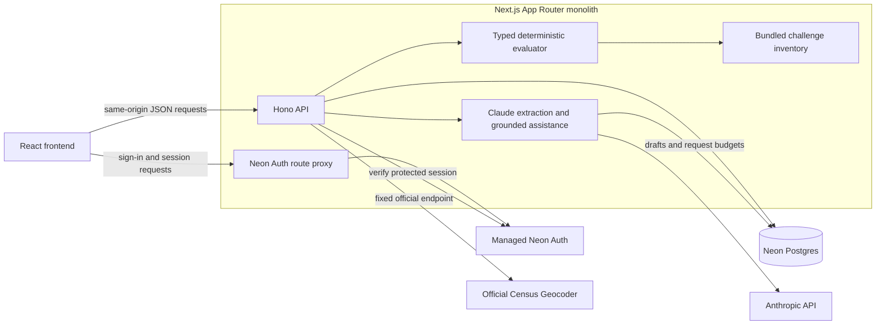
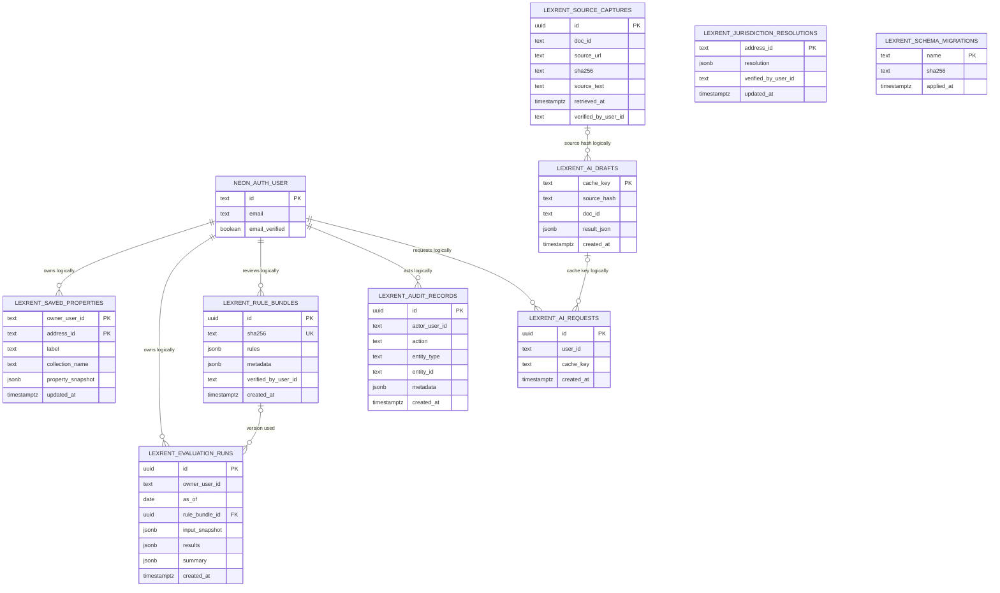
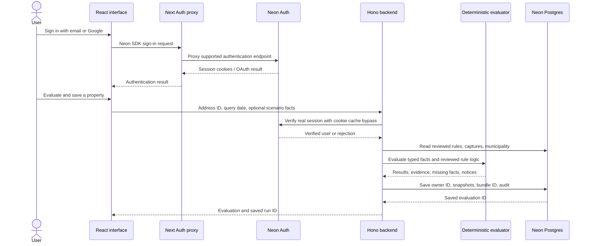
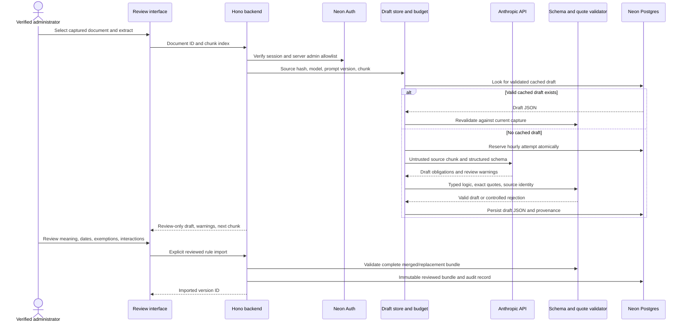
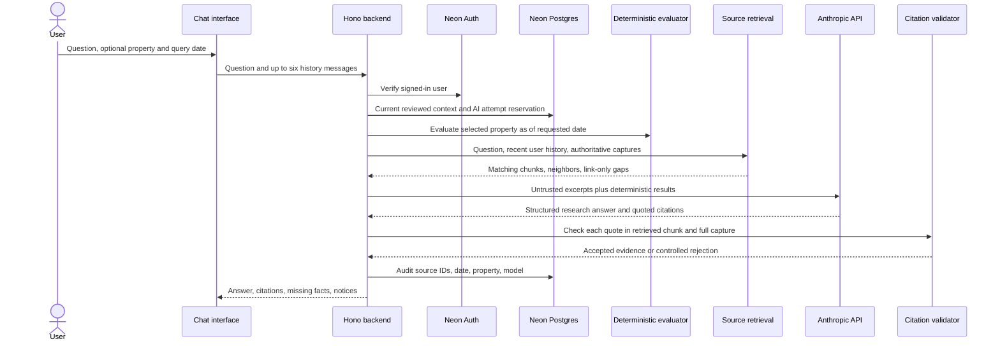

# LEXRENT architecture

LEXRENT is an evidence-first rental housing law navigator for the supplied project challenge. It combines property search, source inspection, rule review, jurisdiction verification, date-sensitive evaluation, change cases, and submission exports in one Next.js application.

The baseline contains **500 properties**, **87 source records**, **54 captured documents**, **33 records without captured text**, and **5 change fixtures**. It starts with **zero verified legal rules**. An empty result never establishes that no law applies. Imported rules and model-generated drafts are separate states.

## Application boundaries

The React interface and Hono API share the same deployment. There is no separately deployed Express server. Next.js routes serve the interface and mount Hono under `/api`; a dedicated `/api/auth/[...path]` route proxies the supported Neon Auth SDK.

| Area | Main implementation | Responsibility |
| --- | --- | --- |
| Interface | `app/`, `src/components/lexrent-app.tsx` | Search, property inspection, scenario inputs, sources, changes, exports, saved work, and administrator review |
| Authentication client | `src/lib/auth-client.ts` | Same-origin Neon sign-up, sign-in, sign-out, and session hook |
| HTTP backend | `src/server/api.ts` | Validate requests, authorize access, select a context, call domain/services, and return controlled errors |
| Session authorization | `src/server/auth.ts` | Revalidate upstream sessions and enforce the server administrator allowlist |
| Persistent data | `src/server/db.ts`, `migrations/` | Parameterized SQL, user ownership, immutable evaluations, source versions, rule versions, and audit records |
| Request context | `src/server/context.ts` | Combine bundled inventory with persistent captures, reviewed rule logic, and jurisdiction resolutions |
| Evaluation | `src/domain/` | Typed coverage, missing facts, rule lifecycle, interactions, fixtures, and exact export structures |
| Boundary verification | `src/server/jurisdiction.ts` | Verify one address against official Census state and incorporated-place geography |
| Extraction | `src/server/ai.ts`, `src/server/extraction-store.ts` | Structured Claude drafts, exact-quote/schema validation, cached results, and extraction budgets |
| Grounded assistant | `src/server/chat.ts`, `src/domain/retrieval-index.ts` | Bounded source retrieval, deterministic property context, structured research answers, and validated citations |
| Inventory build | `scripts/build-challenge-data.ts` | Preserve the supplied CSV/manifest/text/fixtures in generated `src/data/challenge.json` |

## Data model

Ownership and source/cache relationships marked “logically” are enforced by backend queries and validation. They are not SQL foreign keys into the managed Neon Auth schema. The evaluation-to-rule-bundle relation is an actual SQL foreign key. The application does not create or change Neon Auth's managed tables.

A draft may use a bundled capture without a row in `lexrent_source_captures`. Chat requests and failed extraction attempts have no corresponding draft; the request ledger is an attempt record, not a list of successful outputs.

Rule-bundle hashes cover both rule records and metadata, including executable coverage logic and the referenced source versions. Each reviewed import stores the source text, URL, hash, and retrieval time it used. Importing different logic or evidence creates a different snapshot. Public requests fetch the latest reviewed bundle and validate it against current captures; the separate list helper retains full import history for administrative use. A reviewed bundle is not a guarantee of complete legal coverage. Evaluation runs retain the selected bundle ID, query date, input facts, jurisdiction resolution, and results; a later source, rule, or municipality update does not rewrite a saved evaluation.

Source captures retain earlier text versions and retrieval times. The ordinary source library presents the latest capture for each document. If a newer capture invalidates a current rule's quote, legal evaluation stops with a review error while source inspection, extraction, and corrected imports remain available. Jurisdiction resolutions hold the latest verified municipality; historical evaluations preserve the resolution they used.

## Authentication and user-owned work

Public starter-data exploration and unsaved evaluation do not require sign-in. Saving properties and evaluation runs does. Each private read, record lookup, and deletion includes the verified user ID in its SQL condition. The client cannot choose another owner ID.

Administrator operations require both a verified email from Neon and an email match in server-only `LEXRENT_ADMIN_EMAILS`. A client-supplied role does not grant privileges. Protected requests recheck the upstream session rather than authorizing solely from a cached signed session cookie. Cross-site mutations are rejected before service calls.

## Source review and AI extraction

Extraction uses source text already in the library. A URL without captured text cannot support an extracted or imported rule. Captured text is treated as data, including any instructions embedded in it. The source URL and document ID are assigned by the server.

Long documents use 20,000-character chunks with 2,000-character overlap. Administrators must review all relevant chunks and deduplicate obligations before publishing a complete document's rule set. Truncated, refused, malformed, or unsupported responses are rejected. Exact quotations must occur in the captured text, with source identity and whitespace preserved.

Durable draft identity includes the source text hash, source ID/URL, model, prompt version, and chunk. Changed source text creates a different cache identity. AI attempts are reserved in a database transaction before a provider request; failed attempts still count. The global AI budget is 200 attempts per hour, with extraction and chat account limits described below. Cached drafts remain review-only and never automatically update the active rule bundle.

## Grounded assistant

`POST /api/ai/chat` requires a real signed-in user, including ordinary accounts. Administrator access is required for extraction and publication, but not for asking a research question. Questions are limited to 2,500 characters; history is limited to six messages of at most 3,000 characters each. The browser holds conversation history. Questions, conversation text, and complete assistant responses are not persisted by the application; the attempt ledger stores an opaque request hash and the audit stores source/date/property/model metadata.

The build validates the optional `AI capabilities/rag_knowledge_base.jsonl` against known source IDs, URLs, source hashes, and captured text. The supplied index contains 568 law chunks, all validated and bundled in `src/data/challenge.json`. Whitespace-normalized records are mapped back to original source spans so quotations retain the captured wording. A changed capture uses fresh chunks from its current text instead of an old indexed version.

Retrieval scores term frequency and rarity, with basic stemming, multilingual topic aliases, explicit document IDs, and property jurisdiction hints. It takes up to eight primary matching chunks, at most three per document, plus neighboring chunks, within a 32,000-character context budget. This is a local text index; it requires no separate vector database or embedding provider. Link-only records may be shown as missing evidence but cannot support a citation. Missing text in this bounded selection does not establish that the complete document lacks a provision or exception.

Claude receives the requested date, selected property's deterministic evaluation, missing facts, and source excerpts. Its output is research assistance. It cannot update verdicts, save scenario facts, publish rules, or change the active bundle. Each citation must match one continuous span of the authoritative capture that is fully covered by retrieved offsets; adjoining or overlapping chunks may jointly cover that span. Whitespace differences are restored to the original captured text, while changed wording, punctuation, omissions and unretrieved gaps are rejected. Rule imports continue to require literal exact quotes. Missing source IDs, unsupported quotations, and incomplete or malformed provider responses are rejected; relevance and legal interpretation still require review.

When no reviewed rules exist, the answer is prefixed with an explicit statement that property-specific applicability has not been evaluated. Unknown coverage also receives an uncertainty notice. This allows useful source research while preserving the backend's legal verdicts. Chat answers are not cached; extraction drafts have a separate persistent cache.

The shared AI request ledger serializes quota reservations with a PostgreSQL transaction lock. Extraction permits 60 attempts per administrator per hour; chat permits 20 attempts per account per hour; both share the 200-attempt global hourly ceiling. Cached extraction drafts do not consume a new provider attempt. Citation validation proves that quoted evidence exists; it does not independently establish that every sentence of a generated interpretation follows from that evidence.

## Evaluation contract

Coverage uses a small typed predicate language: `all`, `any`, `not`, and comparisons over an allowlisted fact field. It does not execute code, SQL, or free-form expressions. Missing facts produce `unknown`; an absent owner fact is not automatically false. A year-built value cannot substitute for a certificate-of-occupancy date.

`certificate_age_years` is a numeric derived fact: completed calendar anniversaries between a valid `certificate_of_occupancy_date` and the query date. The server computes it after scenario overrides, replacing any supplied age, and the public facts API rejects the derived field. A missing, invalid or future certificate date produces an unknown age. For `2011-10-04`, the value is 14 on `2026-10-03` and 15 on `2026-10-04`; February 29 reaches an anniversary on March 1 in a non-leap year. Reviewed predicates can therefore express a rolling fifteen-year threshold without a fixed date cutoff. The calculation does not independently prove the legal exemption or its anniversary convention; those remain review decisions.

The supported categories are rent increases, just-cause eviction, security deposits, application/screening fees, screening restrictions, and algorithmic rent setting. Requirements remain separate rule records even when they arise from the same law.

Lifecycle metadata distinguishes enacted, future-effective, pending, and failed rules. A query date is validated as a real calendar date. Fixture mappings identify which reviewed records correspond to the supplied change cases; those aliases never prove legal meaning or generate an affected address list.

An enactment date alone does not activate a pending record when its effective date is missing. A failed proposal without a failure date remains unknown for historical queries before the baseline snapshot rather than projecting its current failure backwards.

City coverage requires a verified municipality. Postal aliases remain candidate cities. The Census resolver accepts a single matched address with matching house number, street, state, and active incorporated-place geography. It leaves address ranges, multiple matches, missing incorporated boundaries, and inconsistent matches for review. Requests use a fixed official endpoint and reject redirects; users cannot supply a network destination.

Rule interactions are explicit records. The evaluator surfaces possible conflicts and uses reviewed supersession relationships. Direct replacement edges are collected from one snapshot of initially applicable requirements, then applied together, so a replacement chain has the same result in every loading order. Unknown, unsupported, pending and future-effective parents cannot replace an applicable requirement. It does not infer that state law always overrides a city law. Change-case outcomes come from evaluated properties and reviewed rules. Expected fixture counts remain visibly separate from evaluated outcomes.

The export routes produce challenge-compatible `rules.json`, `lookups.json`, and `changes.json`, plus a readiness report. The 500 lookup keys are retained even when no rules have been imported. `ready` is true only when at least one reviewed rule exists and every supplied change case has `evaluation_status: "evaluated"`. `unresolved_address_count` separately counts addresses with an unverified municipality or an unknown rule result; it does not gate that flag or count every missing input or source gap. Each property result always has `coverage_complete: false`. Readiness and exports therefore do not certify complete legal coverage or compliance.

## Team ownership

| Participant | Main responsibility | Concrete handoff |
| --- | --- | --- |
| Technical participant with Codex | Backend, contracts, database/auth, deterministic engine, jurisdiction resolver, tests, deployment | Working API, secure persistence, validated exports, reproducible checks, and schema contracts |
| Technical participant with AI credits | Source completeness, extraction quality, normalized rules, lifecycle/interactions, and gap review | Exact captured quotations, reviewed coverage logic, deduplicated obligations, source gaps, cached reproducible drafts, and fixture mappings supported by evidence |
| Participant building the frontend in Lovable | Interface, property flow, evidence drawer, date/scenario controls, draft review, change results, and demonstration | A polished interface consuming the agreed API and displaying unknowns and review requirements clearly |

Agree on rule fields, predicate fields, result statuses, evidence offsets, import payloads, and error responses before parallel work. The frontend renders backend verdicts; the model creates review drafts; the deterministic engine evaluates reviewed rules.

The highest-value source work is closing missing evidence for local algorithmic bans, Massachusetts pending measures, and the failed rent proposal represented by change cases T2, T4, and T5. Fixture expectations must remain separate from source evidence. No participant should hard-code a law or tune an answer to a target address count.

## Operations and limits

Server configuration is stored in `.env` and must remain outside source control and browser bundles:

- `DATABASE_URL`: Neon Postgres connection.
- `NEON_AUTH_BASE_URL`: managed Neon Auth endpoint.
- `NEON_AUTH_COOKIE_SECRET`: random secret of at least 32 characters.
- `LEXRENT_ADMIN_EMAILS`: trusted, comma-separated administrator emails.
- `ANTHROPIC_API_KEY`: Claude API credentials.
- `CLAUDE_MODEL`: optional model override.

Email verification, Google OAuth, and trusted application origins are configured in Neon. Application code cannot make an unverified account into a verified administrator. Google needs a configured provider and approved redirect origins; local development needs localhost enabled.

Use Node 24 or later. `npm run data:build` regenerates inventory; `npm run db:migrate` applies additive migration files; `npm run typecheck`, `npm test`, and `npm run build` validate the app. Applied migration hashes are recorded, and changing an applied migration is rejected. Add a new migration rather than rewriting an existing one.

The Neon schema and live persistence/ownership path have been verified. The opt-in `tests/auth/neon-live.test.ts` uses temporary random owners and removes only its own records; normal test runs skip it. Tests use synthetic legal records only inside tests. No synthetic legal rule is seeded into production.

Known practical limits:

- The supplied sample omits 212 year-built values, 242 unit counts, and 130 ZIP values. Scenario inputs are user-supplied facts, not independently verified property records.
- A capture may be old, incomplete, blocked, navigation-heavy, or a page about a bill rather than its operative text. Exact-quote validation proves consistency with the stored capture; it does not independently prove that the capture came from the live official page or that the quoted passage supports the complete legal interpretation.
- Source, exemption, lifecycle, and conflict review remain human responsibilities. An AI response is not a reviewed legal rule.
- Retrieval has a bounded evidence window. Important exceptions may appear in another chunk, another document, or uncaptured material. A cited research answer still needs context and interpretation review before legal reliance or publication.
- Current Census geography verifies the current matched municipality. Historical municipal boundaries, parcel-level edge cases, address ranges, and unincorporated locations may need a separate boundary review.
- Cached extraction drafts are reproducible by input identity, but concurrent identical requests can still consume more than one provider attempt before a draft is stored.
- A configured service may be unreachable. Writes and uncertain legal evaluations fail with controlled errors rather than claiming success. Missing auth/database/AI configuration does not grant a local bypass.
- The app does not certify legal completeness. It evaluates only reviewed records and continues to identify missing facts, evidence gaps, pending proposals, and unresolved conflicts.

Primary integration references: [Neon Auth Next.js SDK](https://github.com/neondatabase/neon-js/blob/main/packages/auth/NEXT-JS.md), [Neon managed auth configuration](https://github.com/neondatabase/website/blob/main/content/docs/cli/neon-auth.md), and [Census Geocoding API](https://geocoding.geo.census.gov/geocoder/Geocoding_Services_API.html).
